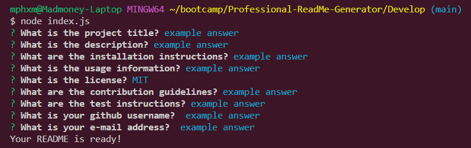
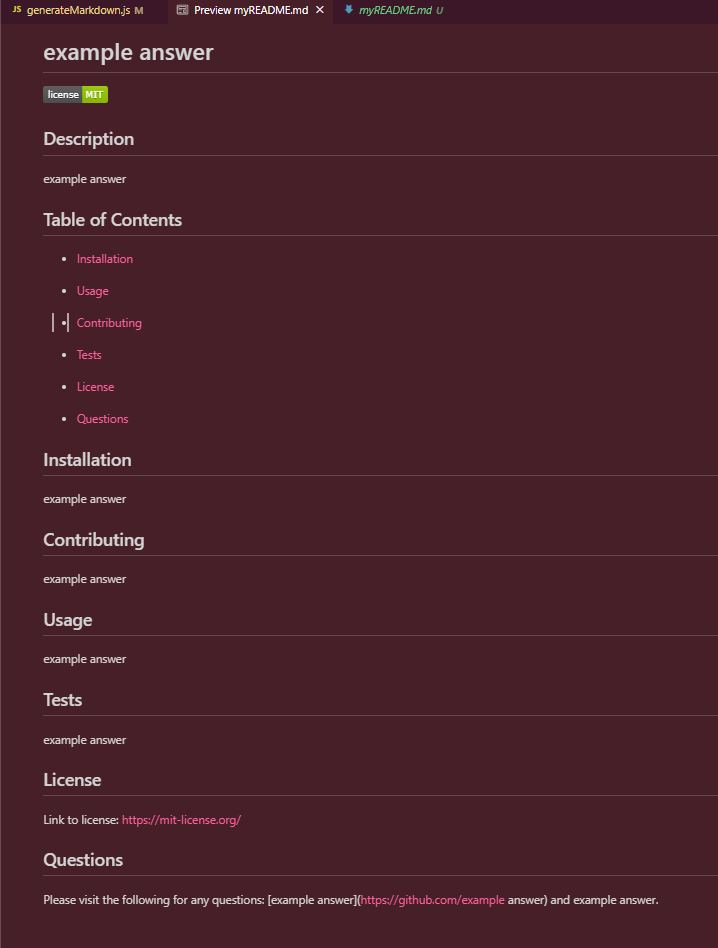

# Professional-ReadMe-Generator
UT's Fullstack Flex Web Development Bootcamp - Challenge 09

## Description
This activity is to create a high-quality README for its users. This includes prompting the user with several questions about their designated README such as the name of the project, the usage of the project, which type of license their project will have etc. This project requires inquirer 8.2.4 to be installed and runs the questions in the integrated terminal of VS code. This code consists of requiring packages necessary for the code to run, switch case functions, template literals, etc. The user will successfully create a readme upon this application

## Usage

https://watch.screencastify.com/v/m9AI9DuKtYdrFl8qShPJ 
https://github.com/mayphamx/Professional-ReadMe-Generator
